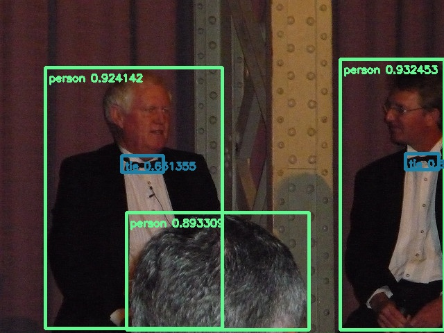

# YOLOV8 example
This package provides 3 yolov8 sample that running on RyzenAI and OnnxRuntime(VitisAI EP) . It allows user to directly run yolov8 on a IPU laptop. 
Please refer to the [Ryzen AI SW platform installation guide](https://ryzenai.docs.amd.com/en/latest/inst.html#) to install all the dependent packages. 

## How to build:
1. move `yolov8`(path: example/yolov8) folder into the 'yolov8_e2e' folder (path: tutorial/yolov8_e2e/..)
```
└── yolov8_e2e
    ├── bin
    ├── code 
    ├── images
    ├── vitis_ai_ep_cxx_samples
    ├── vitis_ai_ep_py_samples
    ├── yolov8
           └── video
           └── yolov8
    └── ...
```
## Run 
cd tutorial\yolov8_e2e\yolov8
### Jpeg sample
```
.\run_jpeg.bat .\DetectionModel_int.onnx .\sample_yolov5.jpg
```
Output:      
result: 0       person  490.38498       85.79535        640.00488       475.18262       0.932453     
result: 0       person  65.96048        97.76373        320.66068       473.83783       0.924142   
result: 0       person  182.15485       306.91266       445.14795       475.26132       0.893309   
result: 27      tie     584.48022       221.15732       632.27008       244.21243       0.851953   
result: 27      tie     175.62622       224.15210       235.84900       248.83557       0.651355    



### Simple camera sample
```
.\camera.bat .\DetectionModel_int.onnx
```

Press **esc** to exit

### Live camera sample
```
.\camera_nx.bat
```

Press **esc** to exit

#### Environment and arguments
`set NUM_OF_DPU_RUNNERS=4` to use 4x1x4

.\camera_nx.bat -h
```
C:\Users\ibane\Desktop\voe-win_amd64-with_xcompiler_on-c07e419-latest\yolov8\..\bin\camera_yolov8_nx1x4 [options...]
Options:
      -c [parallel runs]: Specifies the (max) number of runs to invoke simultaneously. Default:1.
      -s [input_stream] set input stream, E.g. set 0 to use default camera.
      -x [intra_op_num_threads]: Sets the number of threads used to parallelize the execution within nodes, A value of 0 means ORT will pick a default. Must >=0.
      -y [inter_op_num_threads]: Sets the number of threads used to parallelize the execution of the graph (across nodes), A value of 0 means ORT will pick a default. Must >=0.    
      -D [Disable thread spinning]: disable spinning entirely for thread owned by onnxruntime intra-op thread pool.
      -Z [Force thread to stop spinning between runs]: disallow thread from spinning during runs to reduce cpu usage.
      -T [Set intra op thread affinities]: Specify intra op thread affinity string.
         [Example]: -T 1,2;3,4;5,6 or -T 1-2;3-4;5-6
         Use semicolon to separate configuration between threads.
         E.g. 1,2;3,4;5,6 specifies affinities for three threads, the first thread will be attached to the first and second logical processor.
      -R [Set camera resolution]: Specify the camera resolution by string.
         [Example]: -R 1280x720
         Default:1920x1080.
      -r [Set Display resolution]: Specify the display resolution by string.
         [Example]: -r 1280x720
         Default:1920x1080.
      -L Print detection log when turning on.
      -h: help
```
1. -c [set channels of yolov8 session]. Recommended as 5-6(Can be real-time and low latency).
2. -x & -y [set num threads of inter and intra op]. Both recommended as 1. Higher values in this(or most) cases do not result in any performance gain but lead to a significant increase in CPU power consumption.
3. -D [Disable thread spinning]. Enable spinning-wait by default, it will causes CPU usage to 100%. We recommended adding '-D', which significantly reduces power with impact on performance
4. -R/-r Please set it according to your computer configuration. Default:[FHD/FHD]
5. -L Printing the log may reduce the frame rate, generally recommended to turn off.
6. -s stream-id, default camera is usually 0.

#### Usage
1.  Recommended(Generally can run in real time(30fps))
```
%cd%\..\bin\camera_yolov8_nx1x4  -c 5 -x 1 -y 1 -s 0 -D 
```
2. More target may be available
```
%cd%\..\bin\camera_yolov8_nx1x4  -c 7 -x 1 -y 1 -s 0 -D 
```
3. Lower camera resolution and higher display resolution
```
%cd%\..\bin\camera_yolov8_nx1x4  -c 5 -x 1 -y 1 -s 0 -D -R 1280x720 -r 2560x1440
```
4. With video file
```
%cd%\..\bin\camera_yolov8_nx1x4  -c 5 -x 1 -y 1 -s video/test.mp4 -D 
```

## Sample Code

```
  auto model = Yolov8Onnx::create(std::string(argv[1]), 0.3); // Create session

  cv::Mat image = cv::imread(argv[2]); // Load a image

  auto results = model->run(image); // Run

  process_result(image, results); // Draw box
```

## Other recommendations
1. About Power mode:
Windows has 3 power by default. they are **Best power efficiency**, **Balenced** and **Best Performance**. 
They will have different performance scheduling strategies and power consuption performance. Power plug-in and battery are also difference.
A brief comparison of them is as follows(tested Live camera sample on HP 835g10):
```
Best power efficiency with plug-in:  fps≈30 | power≈11w
Balenced with plug-in:  fps≈30 | power≈15w
Best Performance with plug-in: fps≈30 | power≈15w
Best power efficiency with battery: fps≈30 | power≈10w
Balenced with plug-in and without -D, -x 1, -y 1: fps≈30 | power≈26w
```
To configure power mode in Windows 11 by following steps:
Open Settings by pressing Win + I or right-clicking the Start menu and selecting Settings.
```
Go to System > Power (or Power and Battery on laptops).
Find the Power mode drop-down list and select one of the following options.
```


2. Display setting
To make the display magnification of opencv normal, please temporarily set the display scaling rate to 100%.
To adjust display scaling in Windows 11, Please:
Open Settings.
```
Click on System.
Click on Display.
Under the "Scale and layout" section, use the drop-down menu and select.
```

